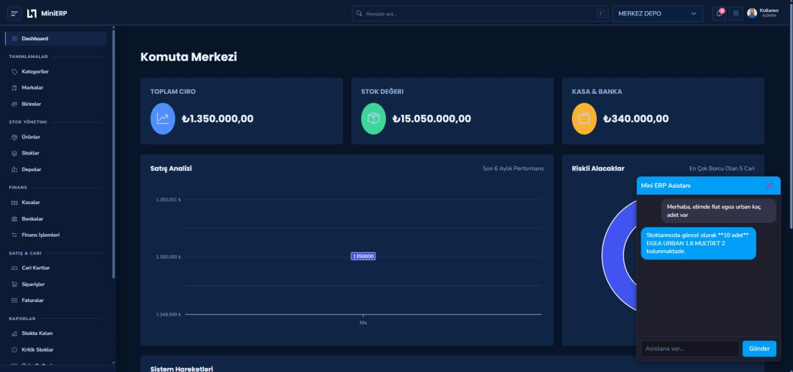

# 🚀 Mini ERP - Full Stack ERP Solution


Mini ERP, modern yazılım mimarileri kullanılarak geliştirilmiş ölçeklenebilir bir kurumsal kaynak planlama (ERP) uygulamasıdır.

Backend tarafında **Onion Architecture** ve **CQRS** prensipleri benimsenirken, frontend tarafında profesyonel ve responsive bir yönetim paneli deneyimi sunulmaktadır.

Bu proje; sürdürülebilir yazılım geliştirme prensipleri, katmanlı mimari yaklaşımı ve gerçek dünya enterprise uygulama deneyimini tek bir yapı altında sunmak amacıyla geliştirilmiştir.

---

# 📸 Ekran Görüntüleri

## Dashboard



---

# 🌟 Öne Çıkan Özellikler

## 📦 Stok Yönetimi

* Dinamik stok takibi
* Çoklu birim desteği
* Ürün ve kategori yönetimi
* Detaylı stok hareket geçmişi

## 🧾 Finans & Fatura Yönetimi

* KDV hesaplamalı fatura sistemi
* Cari hesap hareketleri
* Finansal işlem takibi
* Döviz formatlama desteği

## 🤖 AI Financial Analyst (Beta)

Finansal verileri analiz etmek amacıyla geliştirilen yapay zeka entegrasyonu.

Mevcut sürümde AI servisleri doğrudan Persistence katmanı içerisinde geliştirilmiştir.

Kullanılan model:

* Gemini 3 Flash Preview

## 🔐 Güvenlik

* JWT tabanlı kimlik doğrulama
* Role-based authorization
* ASP.NET Identity entegrasyonu
* Permission yönetimi

## 🎨 Kullanıcı Arayüzü

* Responsive dashboard tasarımı
* NiceAdmin tabanlı yönetim paneli
* Mobil uyumlu yapı
* Modern kullanıcı deneyimi

---

# 🛠️ Teknoloji Yığını

| Alan           | Teknolojiler                                      |
| -------------- | ------------------------------------------------- |
| Backend        | .NET 8 Web API, Entity Framework Core, SQL Server |
| Authentication | ASP.NET Identity, JWT                             |
| Kütüphaneler   | MediatR, FluentValidation, AutoMapper             |
| Mimari         | Onion Architecture, CQRS Pattern                  |
| Frontend       | React (Vite), TypeScript, Axios Interceptors      |
| UI             | NiceAdmin (BootstrapMade)                         |
| DevOps         | Docker, Docker Compose, Nginx                     |

---

# 🧠 Mimari Yaklaşım

## Onion Architecture

Proje; bağımlılıkların azaltılması, sürdürülebilirlik ve katmanlı yapı hedeflenerek Onion Architecture yaklaşımıyla geliştirilmiştir.

Bağımlılıklar merkeze (Domain katmanına) doğrudur.

## CQRS Pattern

CQRS yaklaşımı; okuma (Query) ve yazma (Command) işlemlerini birbirinden ayırarak karmaşık iş mantıklarını daha yönetilebilir ve ölçeklenebilir hale getirmeyi amaçlamaktadır.

---

# 📂 Proje Yapısı

```plaintext
src/
├── MiniERP.Domain       # Entity'ler ve Core Interfaces
├── MiniERP.Application  # CQRS Handler'lar, DTO'lar ve Business Logic
├── MiniERP.Persistence  # DbContext, Migration'lar ve Repository Implementasyonları
├── MiniERP.WebAPI       # Controller'lar ve Middleware'ler
└── mini-erp-ui          # React (Vite) Frontend Projesi
```

---

# 🚀 Kurulum (Docker)

Sistemi tek bir komutla tüm bağımlılıklarıyla birlikte ayağa kaldırabilirsiniz.

## Gereksinimler

* Docker Desktop

---

## Repoyu Klonlayın

```bash
git clone https://github.com/ozturkbugra/MiniERP.git
```

---

## Proje Dizinine Geçin

```bash
cd MiniERP
```

---

## Sistemi Başlatın

```bash
docker-compose up -d
```

---

# 🌐 Erişim Noktaları

| Servis          | Adres                         |
| --------------- | ----------------------------- |
| Frontend UI     | http://localhost:3000         |
| Backend Swagger | http://localhost:5000/swagger |
| SQL Server      | localhost, 1433               |

---

# ⚙️ Environment Variables

```json
{
  "Jwt": {
    "Key": "YOUR_SECRET_KEY"
  },
  "ConnectionStrings": {
    "SqlServer": "YOUR_CONNECTION_STRING"
  },
  "Gemini": {
    "ApiKey": "YOUR_API_KEY"
  }
}
```

---

# 🐳 Dockerized Environment

Tüm sistem Docker container’ları üzerinde çalışmaktadır.

Container yapısı:

* Frontend Container
* Backend API Container
* SQL Server Container
* Nginx Reverse Proxy

Bu yapı sayesinde:

* Hızlı kurulum
* Ortam tutarlılığı
* Kolay deployment
* Daha sürdürülebilir geliştirme ortamı

sağlanmaktadır.

---

# 🗺️ Roadmap

* [ ] AI servislerinin ayrı bir katmana taşınması
* [ ] PDF & Excel tabanlı raporlama sistemi
* [ ] Tailwind CSS geçişi
* [ ] Redis tabanlı caching mekanizması

---

# 📄 Lisans & Notlar

UI tasarımı için BootstrapMade üzerinden lisanslanan NiceAdmin template altyapısı kullanılmıştır.

Bu proje eğitim ve portfolyo geliştirme amacıyla hazırlanmıştır.

---

# 👨‍💻 Geliştirici

Buğra Öztürk

* Full Stack Development
* .NET & React Ecosystem
* Enterprise Architecture
* AI-powered applications
